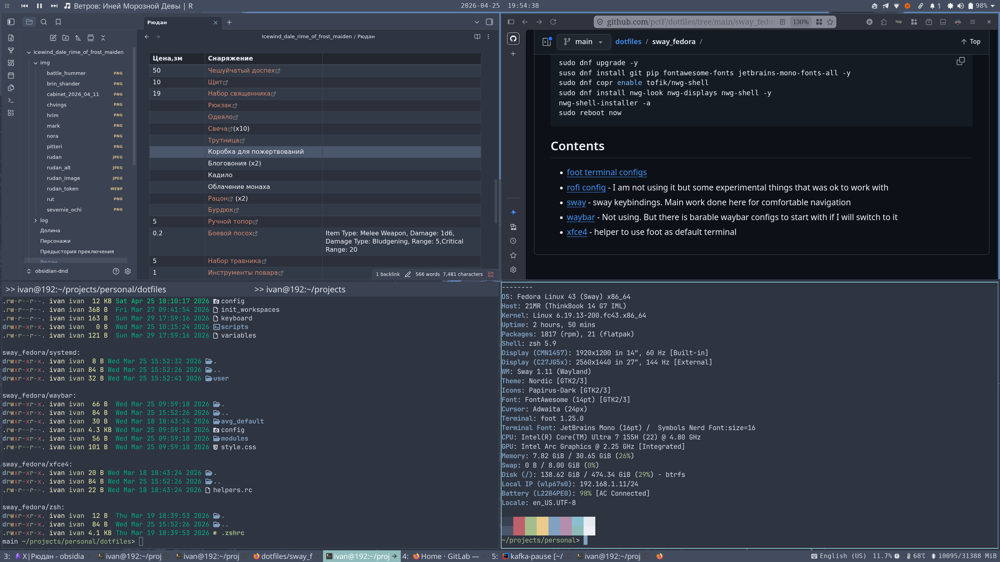

# Fedora 43 Saway spin initial dot files
Small amount of pre-configurations (bindings, keyboard etc) for fedora sway spin + nwg-shell to have working pc from the start



## pre
* fonts: Jetbrains, FontAwesome
* nwg shell (copr tofik/nwg-shell)

```shell
sudo dnf upgrade -y
suso dnf install git pip fontawesome-fonts jetbrains-mono-fonts-all -y
sudo dnf copr enable tofik/nwg-shell
sudo dnf install nwg-look nwg-displays nwg-shell -y
nwg-shell-installer -a
sudo reboot now
```

## Contents
* [foot terminal configs](foot)
* [rofi config](rofi) - I am not using it but some experimental things that was ok to work with
* [sway](sway) - sway keybindings. Main work done here for comfortable navigation
* [waybar](waybar) - Not using. But there is barable waybar configs to start with if I will switch to it
* [xfce4](xfce4) - helper to use foot as default terminal
